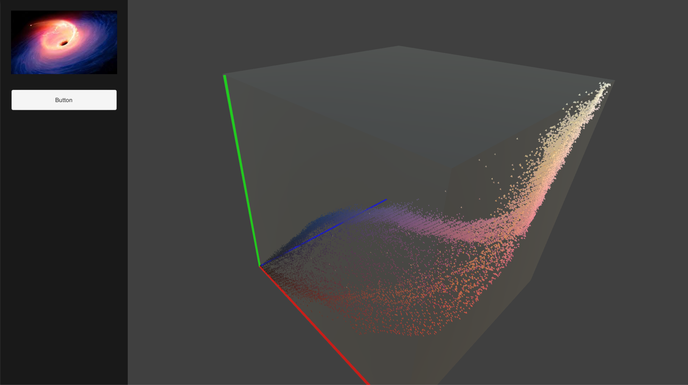
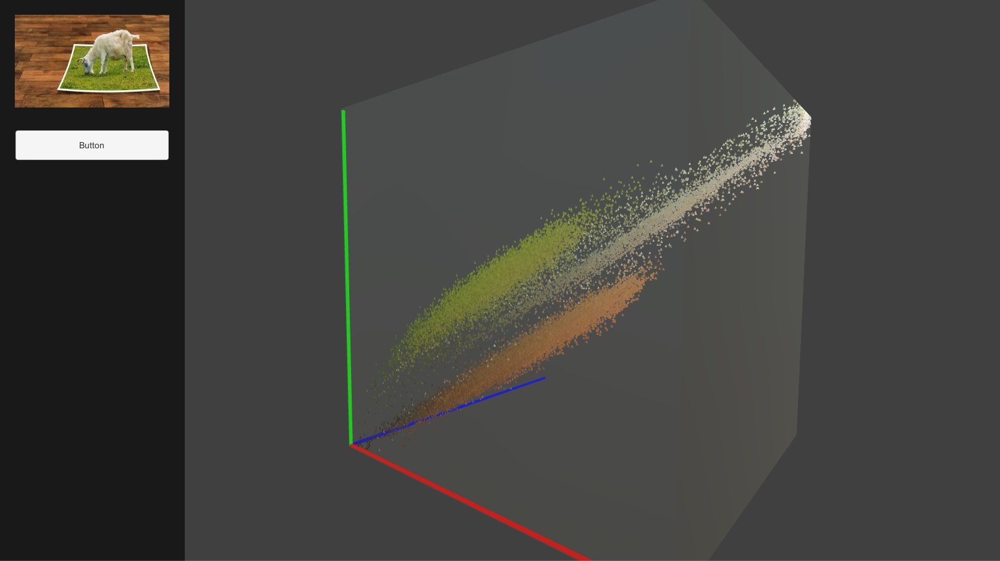

# Color-space-viewer

An image viewer in RGB color space.

## Requirements

Unity 2019.2.4f1

## Viewer

<html>
    <body>
        

            
            
        

    </body>
</html>

## Contact

> Ific Goudé  
Research Scientist in Computer Graphics  
Email: goude.ific@gmail.com  
Website: [https://igoude.github.io/](https://igoude.github.io/)
